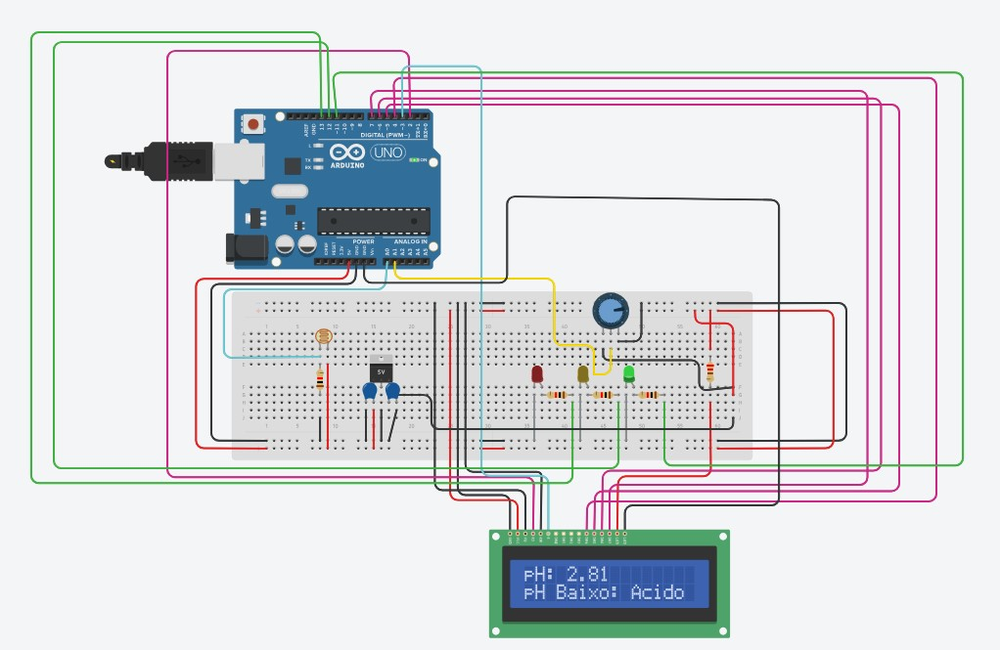

# Sensor de turbidez e ph com arduino
<h2>Detalhes do projeto</h2>
 O projeto consiste em um sensor de turbidez que é a medida da dificuldade de um feixe de luz atravessar uma certa quantidade de água, dando uma aparência turva à mesma e o ph que é uma escala logarítmica que mede o grau de acidez, neutralidade ou alcalinidade de uma determinada solução, no caso desse projeto, o foco é em medir o ph e a turbidez com foco em ambientes de água salgada.
 Por conta de llimitações da plataforma que utilizamos para montar a simulação (tinkercad) que não tinha um sensor de ph e um sensor de turbidez, optamos por criar um sistema de turbidez utilizando um LDR(Sensor de Luminosidade) para calcular conforme o tom da água,quanto mais poluída a água estiver, maior q turbidez e menor a luminosidade.
  Esse projeto surgiu para a global solution de 2024 em parceria com a Oceans 20 (O20), que tem o objetivo de assegurar que as atividades humanas nos oceanos sejam ecologicamente responsáveis, socialmente inclusivas e economicamente viáveis a longo prazo. Nesse projeto buscamos lidar com a parte de monitoração de habitats marinhos para assegurar o bem estar das espécies da área analisada.
  
  

<h2>Tecnologias Utilizadas</h2>
<li> Tinkercad
<li> Arduino IDE

<h2>Requisitos para construir o projeto</h2>
<li> 1x computador
<li> Arduino IDE
<li> 1x arduino uno
<li> 1x protoboard
<li> 14x jumper cables
<li> 1x 220 Ω Resistor
<li> 4x	1 kΩ Resistor
<li> 1x led vermelho
<li> 1x led amarelo 
<li> 1x led verde
<li> 1x	LCD 16x2
<li> 1x	Fotorresistor
<li> 1x	250 kΩ Potenciômetro
<li> 1x	Regulador 5V [LM7805]
<li> 1x	0.22 uF Capacitor
<li> 1	0.1 uF Capacitor

<h2>Instruções de uso</h2>
<li> Copie o codigo no link do tinkercad
<li> Cole ele na ide do arduino
<li> Monte o seu circuito arduino
<li> Conecte ele ao seu pc e rode

<h2>Links importantes</h2>
<li> Link para a simulação no tinkercad: https://www.tinkercad.com/things/jP3Q9whdFKz-sensor-de-turbidez-ph-gs
<li> Link para o vídeo que demonstra a simulação: aqui ficara o link

